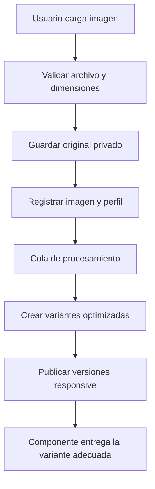

# SDD – Sistema centralizado de optimización y entrega de imágenes

## 1. Información general

**Proyecto:** Realestate Inmobiliario Alis  
**Estado:** Propuesta de diseño para implementación  
**Objetivo principal:** Garantizar que toda imagen cargada en la aplicación sea procesada, optimizada y entregada según el dispositivo y el contexto de uso, priorizando la velocidad de carga y preservando una calidad visual adecuada.

## 2. Problema a resolver

Las imágenes de propiedades, banners, logotipos y demás recursos visuales pueden llegar al sistema con tamaños, dimensiones y formatos inconsistentes. Si se almacenan y publican directamente, pueden elevar innecesariamente el peso de la página, afectar las métricas Core Web Vitals y retrasar en especial la carga inicial de la página de inicio.

La optimización no debe depender de cada módulo ni de acciones manuales del usuario. Toda carga de imagen debe aplicar una única política central, reutilizable y verificable.

## 3. Alcance

El sistema aplicará a todas las imágenes nuevas cargadas mediante la aplicación, incluyendo:

- Fotos de propiedades y galerías.
- Imagen destacada de una propiedad.
- Banners, promociones y contenido de la página principal.
- Imágenes de agentes, usuarios y empresas.
- Logotipos, iconos rasterizados y elementos gráficos administrables.
- Imágenes que se agreguen a módulos futuros.

La solución incluye carga, validación, procesamiento, almacenamiento, generación de variantes, entrega responsive y monitoreo. No modifica ni elimina imágenes ya existentes en la primera fase; estas se incorporarán mediante una migración controlada.

## 4. Objetivos funcionales

- Centralizar el procesamiento en un servicio de imágenes único para toda la aplicación.
- Generar variantes de una imagen según el uso y ancho de pantalla.
- Generar WebP como formato de entrega obligatorio y AVIF cuando el servidor y la librería instalada lo soporten de forma confiable.
- Conservar el original privado únicamente para reprocesamiento, auditoría y futuras variantes.
- Impedir que el navegador descargue una imagen de escritorio cuando necesita una versión móvil.
- Definir dimensiones explícitas en el HTML para reducir el desplazamiento visual acumulado (CLS).
- Dar prioridad a la imagen principal visible en la home y diferir las demás imágenes fuera de pantalla.
- Permitir reemplazar, regenerar o eliminar todas las variantes de una imagen desde un único punto.

## 5. Requisitos no funcionales

| Área | Requisito |
| --- | --- |
| Rendimiento | La home debe solicitar inicialmente solo los recursos visuales necesarios para el contenido visible. |
| Calidad | Cada variante debe conservar una calidad visual adecuada para su contexto, sin enviar píxeles innecesarios. |
| Compatibilidad | Se entregará WebP en navegadores compatibles y un fallback JPG/PNG optimizado cuando sea necesario. |
| Seguridad | Solo se aceptarán archivos de imagen válidos y se descartará contenido ejecutable o con tipo MIME inconsistente. |
| Escalabilidad | El procesamiento pesado debe poder ejecutarse en cola, sin bloquear innecesariamente la respuesta de carga. |
| Mantenibilidad | Las reglas de tamaños y calidad deben definirse por perfiles reutilizables, no dentro de cada vista. |
| Accesibilidad | Toda imagen de contenido debe mantener texto alternativo administrable y significativo. |

## 6. Arquitectura propuesta

### 6.1 Componentes

1. `ImageUploadService`
   - Punto de entrada único para cualquier imagen subida desde formularios, API o panel administrativo.
   - Valida, normaliza el nombre, registra el original y envía el procesamiento a la cola.

2. `ImageProcessingService`
   - Lee la imagen original, elimina metadatos innecesarios, corrige orientación EXIF, redimensiona, comprime y genera las variantes indicadas por el perfil.

3. `ImageProfile`
   - Configuración central de cada contexto de uso: propiedad, portada de home, card, galería, avatar, logo y banner.
   - Define proporción, anchos permitidos, calidad, recorte y formatos.

4. `ProcessedImage` / catálogo de variantes
   - Registra la relación entre el recurso original y sus archivos publicados: formato, ancho, alto, peso, ruta, perfil y estado.

5. `ResponsiveImageComponent`
   - Componente Blade/Livewire reutilizable que genera automáticamente `<picture>`, `srcset`, `sizes`, atributos de dimensiones, `alt` y estrategia de carga.

6. Cola de procesamiento
   - Ejecuta los trabajos de optimización de forma asíncrona y permite reintentos controlados.

7. Almacenamiento público/CDN
   - Guarda exclusivamente las variantes preparadas para servir al navegador. El original se conserva fuera del acceso público directo.

### 6.2 Flujo de carga



## 7. Política de formatos y calidad

### 7.1 Formatos de entrada permitidos

- JPG/JPEG, PNG y WebP.
- AVIF como entrada solo si la infraestructura puede procesarlo de forma estable.
- SVG se manejará por un flujo separado y restrictivo; no pasará por el procesador raster.
- GIF animado no será aceptado como imagen estándar de propiedad. Si se requiere animación, se evaluará como video o recurso específico.

### 7.2 Reglas de procesamiento

- Corregir automáticamente la orientación capturada por el teléfono.
- Eliminar datos EXIF, GPS y otros metadatos no esenciales antes de publicar.
- Limitar el tamaño máximo de archivo de subida a 12 MB por imagen y la resolución máxima a 6000 × 6000 px. Los límites se harán configurables.
- Rechazar imágenes corruptas, con MIME inconsistente o dimensiones anómalas.
- No ampliar imágenes pequeñas para crear versiones mayores: se generarán solo las variantes que su resolución permita.
- Convertir a WebP para publicación. Generar AVIF cuando esté habilitado; mantener JPG optimizado como fallback para los navegadores que lo requieran.
- Aplicar compresión con objetivos iniciales: AVIF 45–55, WebP 72–78 y JPG 78–82. Los valores podrán ajustarse mediante pruebas visuales y de peso.

## 8. Perfiles y variantes iniciales

Los tamaños indican ancho máximo. La altura se calculará proporcionalmente, excepto cuando el perfil exija recorte.

| Perfil | Uso | Variantes WebP/AVIF | Regla de encuadre | Carga |
| --- | --- | --- | --- | --- |
| `home_hero` | Imagen principal visible de home | 640, 960, 1280, 1600, 1920 px | Proporción definida por diseño; `cover` | Prioritaria |
| `home_card` | Propiedades y bloques visibles en home | 320, 480, 640, 960 px | 4:3 o proporción del diseño | Prioridad normal; lazy fuera del primer bloque |
| `property_cover` | Portada de detalle de propiedad | 640, 960, 1280, 1600 px | Proporción original o diseño aprobado | Prioritaria en detalle |
| `property_gallery` | Galería de propiedad | 480, 800, 1200, 1600 px | Conservar proporción | Lazy |
| `thumbnail` | Miniaturas y previews | 160, 240, 320 px | Recorte centrado | Lazy |
| `avatar` | Usuario/agente | 96, 160, 256 px | Cuadrado con recorte centrado | Lazy |
| `brand_logo` | Logo administrable | 96, 144, 192, 288 px | Conservar proporción | Según ubicación |
| `content_banner` | Banners administrables | 640, 960, 1280, 1600 px | Proporción definida por el diseño | Lazy, salvo hero |

No se utilizará una variante grande por defecto en tarjetas, listados ni carruseles. Cada vista debe seleccionar un perfil según su intención visual.

## 9. Entrega responsive en frontend

El componente central deberá generar HTML equivalente al siguiente patrón:

```html
<picture>
  <source
    type="image/avif"
    srcset="imagen-480.avif 480w, imagen-960.avif 960w, imagen-1600.avif 1600w"
    sizes="(max-width: 640px) 100vw, (max-width: 1024px) 50vw, 33vw">
  <source
    type="image/webp"
    srcset="imagen-480.webp 480w, imagen-960.webp 960w, imagen-1600.webp 1600w"
    sizes="(max-width: 640px) 100vw, (max-width: 1024px) 50vw, 33vw">
  
</picture>
```

Reglas obligatorias:

- Usar `srcset` y `sizes` basados en el ancho real que ocupa la imagen en el layout, no valores genéricos.
- Incluir `width` y `height` o `aspect-ratio` en toda imagen para reservar espacio antes de descargarse.
- Aplicar `loading="lazy"` a imágenes que estén fuera de la primera área visible.
- La imagen LCP de la home deberá usar `loading="eager"`, `fetchpriority="high"` y, si es conocida al renderizar, `preload` para su variante principal. No aplicar estas prioridades a múltiples imágenes.
- Usar `decoding="async"` en imágenes no críticas.
- Definir placeholder liviano opcional (color dominante o versión miniatura) para galerías; no usar un placeholder que pese más que el beneficio visual.
- Evitar carruseles que descarguen todas las fotos de una propiedad al iniciar. Cargar solo la visible y las inmediatas necesarias.

## 10. Modelo de datos sugerido

### Tabla `media_images`

| Campo | Descripción |
| --- | --- |
| `id` | Identificador de la imagen lógica. |
| `disk` | Disco o proveedor de almacenamiento. |
| `original_path` | Ruta privada del original. |
| `original_mime_type` | Tipo MIME validado. |
| `original_width`, `original_height` | Dimensiones originales. |
| `original_bytes` | Peso original. |
| `alt_text` | Texto alternativo administrable. |
| `status` | `pending`, `processing`, `ready`, `failed`. |
| `processing_error` | Diagnóstico para personal autorizado. |
| `created_by` | Usuario que realizó la carga. |
| `created_at`, `updated_at` | Auditoría. |

### Tabla `media_image_variants`

| Campo | Descripción |
| --- | --- |
| `id` | Identificador de variante. |
| `media_image_id` | Relación con la imagen lógica. |
| `profile` | Perfil aplicado, por ejemplo `home_card`. |
| `format` | `avif`, `webp` o `jpg`. |
| `width`, `height` | Dimensiones generadas. |
| `bytes` | Peso final para control de calidad. |
| `path` | Ruta pública de la variante. |
| `checksum` | Detección de cambios e integridad. |
| `created_at` | Fecha de generación. |

## 11. Integración en Laravel y Livewire

- Las pantallas no deben escribir directamente en el almacenamiento público. Deben utilizar `ImageUploadService`.
- Los componentes Livewire mostrarán el estado de procesamiento: “Preparando imagen”, “Lista” o “No se pudo procesar”.
- Una imagen nueva podrá tener una previsualización local durante la carga; la publicación definitiva usará únicamente las variantes procesadas.
- Los modelos que hoy contienen una ruta de imagen se migrarán gradualmente a una relación polimórfica con `media_images`, por ejemplo `imageable`.
- El componente Blade/Livewire será el único autorizado para renderizar imágenes de contenido en vistas nuevas o modernizadas.
- Las URLs de variantes serán inmutables o incluirán una versión/hash para permitir caché prolongada y evitar servir contenido anterior tras un reemplazo.

## 12. Procesamiento asíncrono y disponibilidad

1. La validación y guardado del original ocurren durante la solicitud de carga.
2. La generación de variantes se ejecuta en un Job de Laravel.
3. El Job debe reintentarse hasta tres veces ante errores transitorios.
4. Si falla, la imagen queda en estado `failed`, se registra el error y no se publica el original como sustituto.
5. Para imágenes críticas de la home administradas por un administrador, la interfaz debe confirmar que la variante está lista antes de permitir marcarla como publicada.
6. Cuando sea necesario publicar inmediatamente, podrá usarse una cola de prioridad alta, sin omitir la optimización.

## 13. Reglas específicas para la home

- Limitar a una sola imagen visualmente prioritaria para LCP por vista.
- La imagen hero debe servirse desde una variante adecuada al contenedor y dispositivo; nunca desde el original.
- Las propiedades visibles en el primer bloque usarán `home_card` con tamaños correctamente declarados.
- Las secciones posteriores, carruseles, testimonios y recursos decorativos se cargarán de forma diferida.
- Las imágenes decorativas sin contenido informativo se implementarán como CSS optimizado o con `alt=""`, según corresponda.
- Se reducirá el número de imágenes iniciales donde el diseño no aporte valor comercial. La optimización de peso no sustituye una selección visual responsable.
- Se medirán LCP, CLS, peso total de imágenes y solicitudes de imágenes en móvil y escritorio antes y después de publicar los cambios.

## 14. Migración de imágenes existentes

La migración se realizará en lotes, sin eliminar originales hasta que cada imagen haya sido verificada.

1. Inventariar rutas actuales, tipos de uso, dimensiones y peso.
2. Asociar cada conjunto a un perfil inicial.
3. Procesar en cola las imágenes existentes y registrar las variantes.
4. Comparar disponibilidad, aspecto visual y tamaño resultante.
5. Cambiar cada vista para usar `ResponsiveImageComponent`.
6. Monitorear errores 404 y métricas de carga.
7. Una vez validado, restringir el uso de rutas antiguas y conservar los originales bajo política de respaldo.

## 15. Seguridad, límites y administración

- Verificar el contenido real del archivo, no solo su extensión.
- Generar nombres de archivo no predecibles y no conservar el nombre original como ruta pública.
- Aplicar autorización: solo usuarios con permiso podrán cargar, reemplazar o eliminar imágenes de recursos que administran.
- Registrar usuario, fecha, recurso relacionado, original y resultado de procesamiento.
- Aplicar límites por imagen y, si se define, por carga múltiple para proteger recursos del servidor.
- Proteger los originales de acceso público directo.

## 16. Observabilidad y métricas

El sistema deberá registrar:

- Cantidad de imágenes procesadas, fallidas y pendientes.
- Tiempo medio de procesamiento por perfil y formato.
- Peso original vs. peso de cada variante y porcentaje de reducción.
- Uso de formatos AVIF, WebP y fallback.
- Errores de decodificación o generación.
- LCP, CLS y peso transferido de imágenes en home, detalle y listados.

Se añadirá una pantalla administrativa simple para reintentar procesos fallidos y regenerar variantes de una imagen o de un perfil completo.

## 17. Criterios de aceptación

1. Toda imagen nueva de los módulos cubiertos pasa por `ImageUploadService` y no queda expuesta directamente desde su original.
2. Cada imagen procesada genera al menos WebP y JPG fallback; AVIF se genera cuando esté habilitado.
3. En móvil, una tarjeta de propiedad no descarga una variante superior al tamaño necesario para su contenedor, salvo la densidad de pantalla correspondiente.
4. Todas las imágenes renderizadas por el componente incluyen dimensiones reservadas y texto alternativo apropiado.
5. La imagen LCP de la home utiliza la prioridad correcta y las imágenes no visibles se difieren.
6. Las galerías no descargan de inicio todas las imágenes de una propiedad.
7. Una carga inválida, corrupta o mayor que los límites definidos se rechaza con un mensaje claro y no deja archivos públicos.
8. El fallo de una variante no expone el archivo original ni interrumpe la visualización de otras imágenes.
9. Las imágenes existentes se pueden reprocesar mediante un comando o tarea en cola, con registro de resultados.
10. Antes de producción se documentan métricas Lighthouse/PageSpeed de home en móvil y escritorio; el cambio no debe empeorar LCP, CLS ni peso total de imágenes.

## 18. Pruebas requeridas

- Unitarias: validación MIME, límites de peso/dimensión, selección de perfil y cálculo de variantes.
- Integración: carga desde cada módulo, generación de variantes, persistencia de metadatos y eliminación/reemplazo.
- Frontend: verificación de `<picture>`, `srcset`, `sizes`, `alt`, `loading`, dimensiones y prioridad LCP.
- Compatibilidad: Chrome, Edge, Firefox, Safari en móvil y escritorio; confirmar fallback cuando AVIF/WebP no corresponda.
- Rendimiento: Lighthouse o PageSpeed en home, página de propiedades y detalle, con red móvil simulada.
- Regresión: verificar que las propiedades existentes, miniaturas, logos y galerías continúan visibles durante la transición.

## 19. Plan de implementación

### Fase 1: Fundaciones

- Definir perfiles, límites y configuración de almacenamiento.
- Crear migraciones, modelos, relaciones y servicios centrales.
- Instalar/configurar la librería de procesamiento compatible con el servidor (GD, Imagick o equivalente).

### Fase 2: Carga y procesamiento

- Implementar el flujo central de carga y el Job de procesamiento.
- Crear variantes WebP/JPG y habilitar AVIF tras confirmar soporte.
- Añadir administración básica de estado y reintentos.

### Fase 3: Entrega responsive

- Implementar `ResponsiveImageComponent`.
- Aplicarlo primero a home, tarjetas de propiedades, portada y galería.
- Implementar lazy loading, atributos de tamaño y prioridad de LCP.

### Fase 4: Migración y medición

- Procesar imágenes existentes por lotes.
- Activar rutas nuevas progresivamente.
- Medir resultados, ajustar compresión y tamaños, y corregir casos visuales.

### Fase 5: Cobertura completa

- Integrar perfiles restantes en usuarios, agentes, banners y módulos nuevos.
- Establecer revisión obligatoria: ningún desarrollo nuevo puede publicar imágenes sin usar el servicio central y componente responsive.

## 20. Decisiones abiertas

- Confirmar el proveedor de almacenamiento actual y si se utilizará CDN.
- Confirmar soporte real del servidor para AVIF e Imagick/GD.
- Validar con diseño las proporciones definitivas de hero, cards, galería y banners.
- Definir si se conservarán originales indefinidamente o bajo una política de retención y respaldo.
- Establecer los objetivos numéricos finales de Core Web Vitals tras medir la línea base actual.

